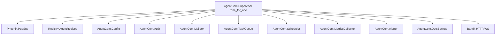
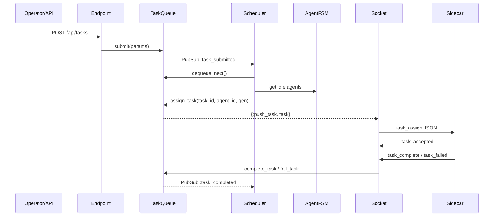
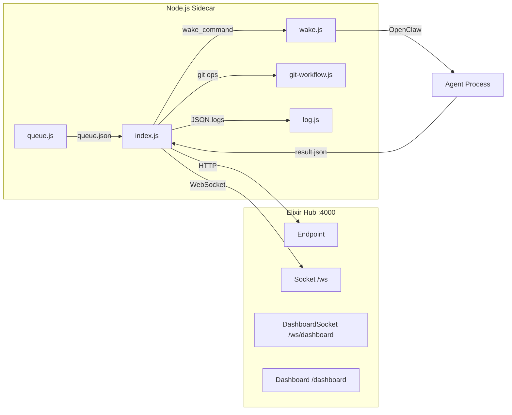

# Phase 16: Operations Documentation - Research

**Researched:** 2026-02-12
**Domain:** Operations documentation for an Elixir/BEAM hub + Node.js sidecar system
**Confidence:** HIGH (based on direct codebase analysis of all 31 Elixir modules, sidecar code, config files, dashboard, and prior phase implementations)

## Summary

Phase 16 produces documentation only -- no new code features. The documentation must enable a solo operator to set up the hub from scratch, monitor it via dashboard/metrics/logs, and troubleshoot common failure modes without reading source code.

The system is an Elixir/OTP application with 20 supervised GenServers, 9 DETS-backed persistence tables, a Node.js sidecar per agent managed by pm2, a self-contained HTML dashboard served at /dashboard, ETS-backed metrics with uPlot charts, structured JSON logging via LoggerJSON, and a configurable alerting system. The documentation must cover all of these components at the operational level.

ExDoc is not currently a dependency in the project. Adding it requires a mix.exs change and a `docs` configuration block. All 31 Elixir modules already have `@moduledoc` strings, which means ExDoc will generate useful module reference pages once configured. The operations guides will be markdown files in `docs/` referenced as ExDoc extras.

**Primary recommendation:** Structure the documentation as 3-4 workflow-based markdown files in `docs/`, integrated with ExDoc as extras, with Mermaid diagrams for architecture visualization and cross-references to module docs for deeper exploration.

<user_constraints>
## User Constraints (from CONTEXT.md)

### Locked Decisions
- Multi-file docs/ directory, organized by workflow (what the operator is doing)
- Files: setup.md, daily-operations.md, troubleshooting.md (or similar workflow-based split)
- Integrated with ExDoc -- guides served alongside generated module docs
- Cross-reference module pages where relevant (e.g., "See AgentCom.TaskQueue for queue internals") so operators can drill deeper
- Primary audience: solo operator who built the system -- skip basics, focus on procedures and reference
- Narrative walkthrough style with explanations of WHY each step matters -- useful when coming back months later
- Include architecture rationale in each major section explaining design reasoning (e.g., why DETS over Postgres, why GenServer per table)
- Include system architecture overview with Mermaid diagrams: component relationships, message flow, supervision tree
- Start from scratch: include installing Erlang/Elixir/Node.js prerequisites
- Dev environment only -- no production deployment section
- Include full agent onboarding: provision agent, connect via sidecar, verify on dashboard (end-to-end first run)
- End with smoke test walkthrough: start hub, connect agent, submit task, verify completion -- confirms the whole pipeline works
- Symptom-based lookup: organized by what you see ("Tasks stuck in pending", "Agent shows offline")
- Log interpretation inline with each symptom -- relevant log lines and jq queries as part of diagnosis steps, not a separate section

### Claude's Discretion
- Troubleshooting depth per issue -- full diagnosis path vs quick fix based on complexity of each failure mode
- Failure mode prioritization -- which issues get the most detailed coverage based on likelihood
- Exact file split within the workflow-based structure
- Mermaid diagram scope and detail level
- ExDoc configuration specifics

### Deferred Ideas (OUT OF SCOPE)
None -- discussion stayed within phase scope
</user_constraints>

## Standard Stack

### Core

| Library | Version | Purpose | Why Standard |
|---------|---------|---------|--------------|
| ex_doc | ~> 0.35 | Documentation generation with guides | Standard Elixir documentation tool; generates HTML docs from @moduledoc and markdown extras. Already used by all deps in this project. |

### Supporting

| Library | Version | Purpose | When to Use |
|---------|---------|---------|-------------|
| Mermaid | (markdown-based) | Architecture diagrams in documentation | ExDoc renders Mermaid diagrams natively in markdown code blocks. No additional dependency needed -- ExDoc 0.30+ supports ```mermaid fenced blocks. |

### Alternatives Considered

| Instead of | Could Use | Tradeoff |
|------------|-----------|----------|
| ExDoc | Static markdown files only | Loses cross-referencing, search, and module doc integration. ExDoc is the locked decision. |
| Mermaid | ASCII art diagrams | Mermaid renders better in HTML, is editable, and ExDoc supports it natively. |
| Separate docs site | ExDoc integrated | ExDoc keeps docs co-located with code and cross-references modules directly. |

**Installation:**
```elixir
# mix.exs - add to deps (dev only)
{:ex_doc, "~> 0.35", only: :dev, runtime: false}
```

## Architecture Patterns

### Recommended Documentation Structure

```
docs/
├── setup.md                  # Hub setup from scratch + first agent onboarding
├── daily-operations.md       # Dashboard, metrics, logs, routine maintenance
├── troubleshooting.md        # Symptom-based failure diagnosis and recovery
└── architecture.md           # System overview, component relationships, design rationale
```

**Rationale for 4 files instead of 3:** The architecture overview with Mermaid diagrams and design rationale is substantial enough to warrant its own file. It serves both setup (understanding what you are building) and troubleshooting (understanding why components interact the way they do). The other 3 files can cross-reference it without duplicating architectural content.

### Pattern 1: ExDoc Guide Integration

**What:** Markdown files in `docs/` are registered as ExDoc "extras" and appear in the left sidebar alongside module documentation.

**How:**
```elixir
# mix.exs - add to project/0
def project do
  [
    # ... existing fields ...
    docs: docs()
  ]
end

defp docs do
  [
    main: "architecture",
    extras: [
      "docs/architecture.md",
      "docs/setup.md",
      "docs/daily-operations.md",
      "docs/troubleshooting.md"
    ],
    groups_for_extras: [
      "Operations Guide": [
        "docs/architecture.md",
        "docs/setup.md",
        "docs/daily-operations.md",
        "docs/troubleshooting.md"
      ]
    ],
    groups_for_modules: [
      "Core": [
        AgentCom.Application,
        AgentCom.Config,
        AgentCom.Auth
      ],
      "Task Pipeline": [
        AgentCom.TaskQueue,
        AgentCom.Scheduler,
        AgentCom.AgentFSM,
        AgentCom.AgentSupervisor
      ],
      "Communication": [
        AgentCom.Socket,
        AgentCom.Mailbox,
        AgentCom.Channels,
        AgentCom.Router,
        AgentCom.Presence,
        AgentCom.Message,
        AgentCom.MessageHistory,
        AgentCom.Threads
      ],
      "Monitoring & Alerting": [
        AgentCom.MetricsCollector,
        AgentCom.Alerter,
        AgentCom.Analytics,
        AgentCom.Telemetry
      ],
      "Dashboard": [
        AgentCom.Dashboard,
        AgentCom.DashboardState,
        AgentCom.DashboardSocket,
        AgentCom.DashboardNotifier
      ],
      "Storage & Backup": [
        AgentCom.DetsBackup
      ],
      "Validation": [
        AgentCom.Validation,
        AgentCom.Validation.Schemas,
        AgentCom.Validation.ViolationTracker
      ],
      "Infrastructure": [
        AgentCom.Reaper,
        AgentCom.Endpoint
      ]
    ]
  ]
end
```

**Confidence:** HIGH -- ExDoc extras and groups_for_modules are well-documented standard features.

### Pattern 2: Cross-References to Module Docs

**What:** Inline links from guide prose to ExDoc-generated module pages using backtick-linkify syntax.

**Example in markdown:**
```markdown
The task queue persists all tasks to DETS. See `AgentCom.TaskQueue` for the full
public API including `submit/1`, `list/1`, and `retry_dead_letter/1`.

When a task is assigned, the scheduler picks the highest-priority queued task
and matches it to an idle agent. See `AgentCom.Scheduler` for matching logic.
```

ExDoc automatically converts backtick-wrapped module names and function references into clickable links when generating HTML docs.

**Confidence:** HIGH -- standard ExDoc feature.

### Pattern 3: Mermaid Diagrams in ExDoc

**What:** Mermaid diagram code blocks in markdown files rendered by ExDoc.

**Example:**
````markdown

````

**Confidence:** HIGH -- ExDoc 0.30+ renders Mermaid natively. Confirmed in ExDoc changelog.

### Anti-Patterns to Avoid

- **Duplicating source code in docs:** Cross-reference module docs instead of copying function signatures into guides. Module docs are the source of truth; guides explain when and why to use them.
- **Writing for a generic audience:** The locked decision says solo operator who built the system. Skip explaining what Elixir is or how GenServers work. Focus on AgentCom-specific procedures.
- **Separate log interpretation section:** The locked decision puts log interpretation inline with each troubleshooting symptom. Do not create a standalone "Understanding Logs" section.
- **Including production deployment:** Explicitly out of scope per locked decision. Dev environment only.

## Don't Hand-Roll

| Problem | Don't Build | Use Instead | Why |
|---------|-------------|-------------|-----|
| Documentation site | Custom HTML/CSS doc pages | ExDoc with extras | ExDoc generates searchable, cross-referenced HTML docs. Already the Elixir standard. |
| Architecture diagrams | Manual SVG/PNG files | Mermaid in markdown | Mermaid is text-based (version-controllable), renders in ExDoc, and editable without graphic tools. |
| API reference docs | Hand-written function listings | ExDoc from @moduledoc/@doc | All 31 modules already have @moduledoc. ExDoc generates API reference automatically. |

**Key insight:** The documentation effort should focus on operational prose (setup procedures, troubleshooting steps, architecture rationale) and let ExDoc handle the API reference generation from existing source annotations.

## Common Pitfalls

### Pitfall 1: ExDoc Dependency Not in :dev

**What goes wrong:** Adding `{:ex_doc, ...}` without `only: :dev` includes it in production builds unnecessarily.
**Why it happens:** Copy-paste from examples that omit the `only:` option.
**How to avoid:** Always use `{:ex_doc, "~> 0.35", only: :dev, runtime: false}`.
**Warning signs:** `mix deps.tree` shows ex_doc as a production dependency.

### Pitfall 2: Stale Cross-References

**What goes wrong:** Guide says "See `AgentCom.FooModule`" but that module was renamed or removed.
**Why it happens:** Documentation written once and not maintained alongside code changes.
**How to avoid:** Run `mix docs` as part of verification to confirm all cross-references resolve. ExDoc warns about broken module references.
**Warning signs:** ExDoc build warnings about unresolved references.

### Pitfall 3: Missing DETS Table in Troubleshooting

**What goes wrong:** Troubleshooting guide covers some DETS tables but misses others, so operator cannot diagnose issues with unlisted tables.
**Why it happens:** There are 9 DETS tables, easy to miss one.
**How to avoid:** Enumerate all 9 tables explicitly: task_queue, task_dead_letter, agent_mailbox, message_history, agent_channels, channel_history, agentcom_config, thread_messages, thread_replies.
**Warning signs:** Troubleshooting section mentions "DETS tables" generically instead of listing them.

### Pitfall 4: Documentation Assumes Hub is Running

**What goes wrong:** Setup guide assumes hub is already running when explaining sidecar connection.
**Why it happens:** Author writes from a running-system perspective rather than from-scratch.
**How to avoid:** Follow the setup guide sequentially: prerequisites -> hub start -> verify hub -> sidecar config -> sidecar start -> verify connection. Each step depends on the previous.
**Warning signs:** Instructions reference API calls or dashboard before explaining how to start the hub.

### Pitfall 5: Mermaid Diagrams Too Complex

**What goes wrong:** A single diagram tries to show all 20+ supervised children with all their interactions, becoming unreadable.
**Why it happens:** Attempting to be comprehensive in one diagram.
**How to avoid:** Use 3-4 focused diagrams: (1) supervision tree overview, (2) task lifecycle flow, (3) message/event flow between components, (4) sidecar-hub communication. Each should have 8-15 nodes maximum.
**Warning signs:** Diagram has more than 15 nodes or more than 20 edges.

## Code Examples

### ExDoc Configuration (mix.exs)

```elixir
# Source: ExDoc documentation + codebase analysis

defp deps do
  [
    # ... existing deps ...
    {:ex_doc, "~> 0.35", only: :dev, runtime: false}
  ]
end
```

### Generating Documentation

```bash
# Generate HTML docs including guides
mix docs

# Open in browser
open doc/index.html   # macOS
start doc/index.html  # Windows
```

### Mermaid: Supervision Tree (Recommended Scope)

```mermaid
graph TD
    SUP["AgentCom.Supervisor<br/>:one_for_one"]

    SUP --> PS["Phoenix.PubSub"]
    SUP --> REG["Registry<br/>AgentRegistry"]
    SUP --> CFG["Config<br/>DETS: agentcom_config"]
    SUP --> AUTH["Auth<br/>File: tokens.json"]
    SUP --> MBX["Mailbox<br/>DETS: agent_mailbox"]
    SUP --> CH["Channels<br/>DETS: channels, history"]
    SUP --> PRES["Presence<br/>In-memory"]
    SUP --> ANA["Analytics<br/>ETS"]
    SUP --> THREADS["Threads<br/>DETS: messages, replies"]
    SUP --> MHIST["MessageHistory<br/>DETS: message_history"]
    SUP --> REAP["Reaper<br/>Stale agent sweep"]
    SUP --> FSMREG["Registry<br/>AgentFSMRegistry"]
    SUP --> ASUP["AgentSupervisor<br/>DynamicSupervisor"]
    SUP --> TQ["TaskQueue<br/>DETS: task_queue, dead_letter"]
    SUP --> SCHED["Scheduler<br/>Stateless"]
    SUP --> MC["MetricsCollector<br/>ETS: agent_metrics"]
    SUP --> ALERT["Alerter<br/>5 rules, cooldowns"]
    SUP --> DS["DashboardState"]
    SUP --> DN["DashboardNotifier<br/>Push notifications"]
    SUP --> BKUP["DetsBackup<br/>Daily backup + compaction"]
    SUP --> BAN["Bandit<br/>HTTP :4000"]
```



### Mermaid: Task Lifecycle (Recommended Scope)



### Mermaid: Sidecar-Hub Communication



## Codebase Inventory for Documentation

### System Components to Document

| Component | Module(s) | Storage | Key Config | Doc Coverage |
|-----------|-----------|---------|------------|-------------|
| Hub startup | `AgentCom.Application` | -- | PORT env, config.exs | setup.md |
| Authentication | `AgentCom.Auth` | priv/tokens.json | ADMIN_AGENTS env | setup.md |
| Task queue | `AgentCom.TaskQueue` | DETS: task_queue, task_dead_letter | task_queue_path | daily-ops, troubleshooting |
| Scheduler | `AgentCom.Scheduler` | Stateless | 30s sweep, 5min stuck threshold | daily-ops, troubleshooting |
| Agent FSM | `AgentCom.AgentFSM` | In-memory per agent | 60s acceptance timeout | troubleshooting |
| Metrics | `AgentCom.MetricsCollector` | ETS: agent_metrics | 10s broadcast, 1hr window | daily-ops |
| Alerting | `AgentCom.Alerter` | In-memory | alert_thresholds via Config | daily-ops, troubleshooting |
| DETS backup | `AgentCom.DetsBackup` | priv/backups/ | backup_dir, compaction_interval | daily-ops, troubleshooting |
| Dashboard | `AgentCom.Dashboard` | -- | /dashboard URL | daily-ops |
| Logging | LoggerJSON | priv/logs/agent_com.log | logger config in config.exs | daily-ops, troubleshooting |
| Reaper | `AgentCom.Reaper` | -- | 30s sweep, 60s TTL | troubleshooting |
| Sidecar | sidecar/index.js | queue.json, results/ | config.json | setup.md |
| Agent onboarding | sidecar/add-agent.js | ~/.agentcom/ | --hub, --name | setup.md |
| Validation | `AgentCom.Validation` | ETS: validation_backoff | -- | troubleshooting |

### All 9 DETS Tables

| Table | Owner GenServer | Default Path | Purpose |
|-------|----------------|--------------|---------|
| task_queue | TaskQueue | priv/task_queue.dets | Active tasks (queued, assigned, completed) |
| task_dead_letter | TaskQueue | priv/task_dead_letter.dets | Failed tasks that exhausted retries |
| agent_mailbox | Mailbox | priv/mailbox.dets | Message mailbox per agent |
| message_history | MessageHistory | priv/message_history.dets | Queryable message archive |
| agent_channels | Channels | priv/channels.dets | Channel metadata and subscriptions |
| channel_history | Channels | priv/channel_history.dets | Channel message history |
| agentcom_config | Config | ~/.agentcom/data/config.dets | Runtime KV configuration |
| thread_messages | Threads | ~/.agentcom/data/thread_messages.dets | Thread message tracking |
| thread_replies | Threads | ~/.agentcom/data/thread_replies.dets | Thread reply chains |

### All HTTP API Endpoints (for reference in docs)

**No auth required:**
- `GET /health` -- Health check (agents_connected count)
- `GET /api/agents` -- List connected agents
- `GET /api/channels` -- List all channels
- `GET /api/channels/:ch` -- Channel info
- `GET /api/channels/:ch/history` -- Channel history
- `GET /api/dashboard/state` -- Dashboard state snapshot
- `GET /dashboard` -- Dashboard HTML page
- `GET /api/metrics` -- System metrics snapshot
- `GET /api/alerts` -- Active alerts
- `GET /api/schemas` -- Schema discovery
- `GET /api/config/default-repo` -- Default repository URL
- `GET /api/dashboard/vapid-key` -- VAPID public key
- `POST /api/onboard/register` -- Agent registration (no auth, solves bootstrap)
- `POST /api/dashboard/push-subscribe` -- Push notification subscription

**Auth required (Bearer token):**
- `POST /api/message` -- Send a message
- `GET/PUT /api/config/heartbeat-interval` -- Heartbeat interval
- `GET/PUT /api/config/mailbox-retention` -- Mailbox TTL
- `GET /api/mailbox/:id` -- Poll messages
- `POST /api/mailbox/:id/ack` -- Acknowledge messages
- `POST /admin/tokens` -- Generate token
- `GET /admin/tokens` -- List tokens
- `DELETE /admin/tokens/:id` -- Revoke token
- `POST /api/tasks` -- Submit task
- `GET /api/tasks` -- List tasks (filterable)
- `GET /api/tasks/dead-letter` -- Dead letter tasks
- `GET /api/tasks/stats` -- Queue statistics
- `GET /api/tasks/:task_id` -- Task details with history
- `POST /api/tasks/:task_id/retry` -- Retry dead-letter task
- `POST /api/admin/backup` -- Trigger DETS backup
- `GET /api/admin/dets-health` -- DETS health metrics
- `POST /api/admin/compact` -- Compact all DETS tables
- `POST /api/admin/compact/:table` -- Compact specific table
- `POST /api/admin/restore/:table` -- Restore table from backup
- `PUT /api/admin/log-level` -- Change runtime log level
- `GET/PUT /api/config/alert-thresholds` -- Alert thresholds
- `POST /api/alerts/:rule_id/acknowledge` -- Acknowledge alert
- `PUT /api/config/default-repo` -- Set default repo URL
- `POST /api/admin/reset` -- Hub reset (ADMIN_AGENTS only)

**WebSocket:**
- `/ws` -- Agent WebSocket connection
- `/ws/dashboard` -- Dashboard real-time updates

### Alerter Rules (for troubleshooting docs)

| Rule | Severity | Trigger | Default Threshold |
|------|----------|---------|-------------------|
| queue_growing | WARNING | Queue depth increasing for N consecutive checks | 3 consecutive increases |
| high_failure_rate | WARNING | Failure rate exceeds percentage threshold | 50% |
| stuck_tasks | CRITICAL | Tasks assigned longer than threshold without progress | 5 minutes (300,000ms) |
| no_agents_online | CRITICAL | All previously registered agents disconnected | 0 online, >0 total |
| high_error_rate | WARNING | Error count in window exceeds threshold | 10 failures/hour |

### Sidecar Configuration Fields

| Field | Required | Default | Purpose |
|-------|----------|---------|---------|
| agent_id | Yes | -- | Agent identifier |
| token | Yes | -- | Auth token from registration |
| hub_url | Yes | -- | WebSocket URL (ws://host:port/ws) |
| hub_api_url | No | -- | HTTP API URL |
| repo_dir | No | "" | Working repository path |
| reviewer | No | "" | Reviewer agent for PRs |
| wake_command | No | -- | Command to invoke agent (with ${TASK_ID}, ${TASK_JSON} interpolation) |
| capabilities | No | [] | Declared capabilities for scheduling |
| confirmation_timeout_ms | No | 30000 | Timeout waiting for task acceptance |
| results_dir | No | ./results | Directory for task result files |
| log_file | No | ./sidecar.log | Sidecar structured log file |
| log_level | No | info | Minimum log level |

## Troubleshooting Failure Modes (Research for docs)

Prioritized by likelihood and impact. Recommendations for depth follow.

### HIGH Priority (full diagnosis paths)

**1. Tasks Stuck in Pending/Queued**
- **Symptom:** Tasks show "queued" status indefinitely, never assigned
- **Causes:** (a) No idle agents connected, (b) Capability mismatch -- task needs capabilities no agent declares, (c) Scheduler not running
- **Diagnosis:** Check `GET /api/agents` for connected agents and their capabilities. Check `GET /api/tasks?status=queued` for needed_capabilities. Check scheduler logs for `scheduler_attempt` events.
- **Log lines:** `{"telemetry_event":"agent_com.scheduler.attempt","measurements":{"idle_agents":0,"queued_tasks":5}}` -- zero idle agents is the smoking gun.
- **jq query:** `jq 'select(.telemetry_event == "agent_com.scheduler.attempt") | {idle: .measurements.idle_agents, queued: .measurements.queued_tasks}' priv/logs/agent_com.log`

**2. Agent Shows Offline / Keeps Disconnecting**
- **Symptom:** Agent appears briefly then disappears, or never appears on dashboard
- **Causes:** (a) Invalid token, (b) Token/agent_id mismatch, (c) Network connectivity, (d) Reaper evicting for stale heartbeat (60s TTL), (e) Sidecar crashed
- **Diagnosis:** Check sidecar logs (`pm2 logs agentcom-<name>`). Check hub logs for `agent_com.agent.disconnect` events with reason. Check Reaper eviction events.
- **Log lines:** `{"message":"reaper_evict_stale","agent_id":"...","stale_ms":61234}` -- agent not sending pings. `{"type":"error","error":"invalid_token"}` -- wrong token.

**3. DETS Corruption / Table Unavailable**
- **Symptom:** API returns errors for task/message operations, dashboard shows "unavailable" for DETS tables, logs show DETS read errors
- **Causes:** (a) Unclean shutdown (power loss, kill -9), (b) Disk full, (c) Concurrent access from non-OTP process
- **Recovery:** Use `POST /api/admin/restore/:table` to restore from backup. If no backup exists, DetsBackup enters degraded mode (deletes corrupted file, restarts with empty table).
- **Automatic recovery:** DetsBackup listens for `{:corruption_detected, table, reason}` casts and auto-restores.
- **Log lines:** `{"message":"dets_corruption_detected","table":"task_queue","action":"auto_restore"}` followed by `{"message":"dets_auto_restore_complete"}`

**4. Queue Backlog Growing**
- **Symptom:** Queue depth increasing, alert fires for `queue_growing`
- **Causes:** (a) Tasks arriving faster than agents complete them, (b) Agent(s) offline, (c) Tasks failing and retrying, consuming agent time
- **Diagnosis:** Check `GET /api/metrics` for `queue_depth.current` and `queue_depth.trend`. Check `error_rates.window.failure_rate_pct`. Check agent utilization.
- **Resolution:** Add more agents (`node add-agent.js`), check why existing agents are failing, check if tasks have unreasonable wake commands.

### MEDIUM Priority (diagnosis + quick fix)

**5. Stuck Tasks (Assigned but Not Completing)**
- **Symptom:** Alert fires for `stuck_tasks` (CRITICAL), tasks show "assigned" for >5 minutes
- **Causes:** (a) Agent process hung, (b) Wake command failing silently, (c) Sidecar lost connection after accepting task
- **Diagnosis:** Check the assigned agent's sidecar logs for wake command output. Check if agent FSM is in "working" or "assigned" state via `GET /api/agents/:id/state`.
- **Resolution:** Scheduler's 30-second stuck sweep auto-reclaims tasks assigned >5 minutes. Can also restart the stuck agent's sidecar.

**6. High Failure Rate**
- **Symptom:** Alert fires for `high_failure_rate` or `high_error_rate`, dead letter queue growing
- **Causes:** (a) Wake command broken, (b) Agent producing invalid results, (c) External dependency down
- **Diagnosis:** Check `GET /api/tasks/dead-letter` for common error patterns. Check sidecar logs for wake command exit codes.
- **Resolution:** Fix root cause in wake command or agent configuration. Retry dead-letter tasks via dashboard or `POST /api/tasks/:id/retry`.

**7. Dashboard Not Updating**
- **Symptom:** Dashboard shows stale data, connection dot shows "Disconnected"
- **Causes:** (a) Browser WebSocket blocked by proxy/firewall, (b) Hub crashed, (c) DashboardState/DashboardNotifier not running
- **Diagnosis:** Check browser console for WebSocket errors. Check `GET /health` to confirm hub is running. Check supervision tree.
- **Resolution:** Refresh browser. If hub is down, check `erl_crash.dump` for OOM or other BEAM-level crashes.

### LOW Priority (quick fix only)

**8. Logs Not Appearing / Wrong Format**
- **Symptom:** Log file empty or not JSON formatted
- **Causes:** (a) priv/logs/ directory not created, (b) LoggerJSON not configured, (c) Log level too high
- **Diagnosis:** Check if `priv/logs/agent_com.log` exists. Check config.exs for logger configuration.
- **Resolution:** Application.start creates priv/logs/ directory. If missing, restart hub. Change log level via `PUT /api/admin/log-level`.

**9. Push Notifications Not Working**
- **Symptom:** No browser notifications for alerts
- **Causes:** (a) VAPID keys not generated, (b) Browser notification permission denied, (c) Service worker not registered
- **Diagnosis:** Check browser console for push subscription errors. Check `/api/dashboard/vapid-key` returns a key.
- **Resolution:** DashboardNotifier auto-generates VAPID keys on first start. Re-enable notifications in browser if denied.

**10. Compaction Not Running / High Fragmentation**
- **Symptom:** DETS health shows high fragmentation ratios (>50%) on dashboard
- **Causes:** (a) DetsBackup not running, (b) Default 6-hour interval not elapsed yet, (c) Compaction threshold (10%) set too high
- **Diagnosis:** Check `GET /api/admin/dets-health` for fragmentation ratios and last compaction time.
- **Resolution:** Trigger manual compaction via `POST /api/admin/compact`. Check compaction history in DetsBackup state.

## Setup Prerequisites (Research for docs)

The setup guide must document installing these prerequisites from scratch:

### Elixir/Erlang (Hub)

| Prerequisite | Minimum Version | Reason |
|-------------|----------------|--------|
| Erlang/OTP | 25+ | Required by Elixir ~> 1.14, provides DETS, :logger, :httpc |
| Elixir | ~> 1.14 | mix.exs specifies this. Provides Mix, Logger, GenServer |
| Mix | (bundled) | Build tool, dependency management |

### Node.js (Sidecar)

| Prerequisite | Minimum Version | Reason |
|-------------|----------------|--------|
| Node.js | 18+ | add-agent.js uses `require('node:util').parseArgs`, sidecar uses modern APIs |
| npm | (bundled) | Package management for sidecar deps |
| pm2 | (global npm) | Process management for sidecar lifecycle |

### Optional

| Prerequisite | Purpose | When Needed |
|-------------|---------|-------------|
| git | Repository cloning for agent onboarding | If using git-workflow features |
| jq | JSON log parsing from command line | For log diagnosis (recommended) |
| OpenClaw | Agent process that executes tasks | For actual task execution (sidecar wakes it) |

## Smoke Test Walkthrough (Research for docs)

The setup guide should end with a complete smoke test. Based on codebase analysis, the steps are:

1. **Start hub:** `mix run --no-halt` (or `iex -S mix` for interactive)
2. **Verify hub:** `curl http://localhost:4000/health` -- expect `{"status":"ok","agents_connected":0}`
3. **Open dashboard:** Navigate to `http://localhost:4000/dashboard` -- should show empty state
4. **Register agent:** `curl -X POST http://localhost:4000/api/onboard/register -H 'Content-Type: application/json' -d '{"agent_id":"test-agent"}'` -- returns token
5. **Configure sidecar:** Create `sidecar/config.json` with agent_id, token, hub_url
6. **Start sidecar:** `cd sidecar && npm install && node index.js`
7. **Verify connection:** Dashboard should show "test-agent" with "idle" state. `GET /api/agents` should list it.
8. **Submit task:** `curl -X POST http://localhost:4000/api/tasks -H 'Authorization: Bearer <token>' -H 'Content-Type: application/json' -d '{"description":"Test task","priority":"normal"}'`
9. **Verify scheduling:** Task should be assigned to test-agent. Dashboard shows it. `GET /api/tasks?status=assigned` returns the task.
10. **Verify completion:** If wake_command is configured, task should complete. Check `GET /api/tasks/:task_id` for status "completed".

**Alternative automated onboarding:** `node sidecar/add-agent.js --hub http://localhost:4000` -- runs steps 4-10 automatically.

## Environment Variables

| Variable | Default | Purpose | Where Used |
|----------|---------|---------|------------|
| PORT | 4000 | Hub HTTP/WS port | config.exs, Application |
| ADMIN_AGENTS | "" | Comma-separated admin agent IDs for /api/admin/reset | Endpoint |
| MIX_ENV | dev | Elixir environment (affects log level, paths) | Mix |

## Configuration Files

| File | Format | Purpose | When Modified |
|------|--------|---------|---------------|
| config/config.exs | Elixir | Base configuration (port, backup_dir, logging) | Setup |
| config/dev.exs | Elixir | Dev-specific overrides | Rarely |
| config/test.exs | Elixir | Test paths (tmp/) | Never in ops |
| config/prod.exs | Elixir | Production log level | Not used (dev only) |
| sidecar/config.json | JSON | Per-agent sidecar configuration | Per agent |
| priv/tokens.json | JSON | Agent authentication tokens | Via API |

## Log File Locations

| Component | File | Format | Rotation |
|-----------|------|--------|----------|
| Hub (stdout) | Console/journald | JSON (LoggerJSON) | N/A |
| Hub (file) | priv/logs/agent_com.log | JSON (LoggerJSON) | 10MB x 5 files, compressed |
| Sidecar | sidecar/sidecar.log | JSON (lib/log.js) | 10MB x 5 files |
| Sidecar (pm2) | ~/.agentcom/<name>/logs/ | Raw stdout/stderr | pm2 managed |

## State of the Art

| Old Approach | Current Approach | When Changed | Impact |
|-------------|-----------------|--------------|--------|
| ExDoc < 0.30 required separate plugin for Mermaid | ExDoc >= 0.30 renders Mermaid natively | ExDoc 0.30 release | Mermaid code blocks in markdown just work |
| Manual agent registration (POST /admin/tokens) | Automated onboarding (POST /api/onboard/register + add-agent.js) | Phase 7 | Setup docs should prefer add-agent.js flow |
| Separate log inspection | Structured JSON with jq | Phase 13 | All log diagnosis uses JSON + jq, not plain text |

## Open Questions

1. **ExDoc version compatibility**
   - What we know: ExDoc ~> 0.35 is current. Mermaid support confirmed since 0.30.
   - What's unclear: Exact latest 0.35.x version at time of implementation.
   - Recommendation: Use `~> 0.35` in mix.exs, `mix deps.get` will resolve to latest patch.

2. **ExDoc `main` page selection**
   - What we know: The `main:` option in docs config sets the landing page.
   - What's unclear: Whether `architecture` or `setup` is a better landing page for this project.
   - Recommendation: Use `"architecture"` as main page since it provides system context. Operators needing setup will navigate to it from the sidebar.

3. **Windows-specific setup instructions**
   - What we know: The project is developed on Windows 11. Elixir/Erlang and Node.js installation differs on Windows.
   - What's unclear: Whether to include Windows-specific paths or keep instructions cross-platform.
   - Recommendation: Include Windows-specific notes where paths differ (e.g., `~/.agentcom/` vs `%USERPROFILE%\.agentcom\`). The operator is on Windows based on the environment.

## Sources

### Primary (HIGH confidence)
- AgentCom codebase -- all 31 Elixir modules in lib/agent_com/, sidecar/*.js, config/*.exs (direct analysis)
- `AgentCom.Application` -- supervision tree with 20 children, telemetry setup, file log handler
- `AgentCom.Endpoint` -- 50+ HTTP/WS routes with auth requirements
- `AgentCom.MetricsCollector` -- ETS-backed metrics with snapshot shape documentation
- `AgentCom.Alerter` -- 5 alert rules with thresholds and cooldowns
- `AgentCom.DetsBackup` -- 9 DETS tables, backup/compaction/restore procedures
- `AgentCom.Telemetry` -- Full event catalog with measurements and metadata
- `sidecar/add-agent.js` -- 7-step automated onboarding flow
- `sidecar/lib/log.js` -- Structured JSON logging with rotation

### Secondary (MEDIUM confidence)
- ExDoc documentation (hexdocs.pm/ex_doc) -- extras configuration, groups_for_modules, Mermaid support
- Mermaid.js documentation (mermaid.js.org) -- diagram syntax for flowcharts and sequence diagrams

### Tertiary (LOW confidence)
- None

## Metadata

**Confidence breakdown:**
- Standard stack: HIGH -- ExDoc is the universal Elixir documentation tool, well-documented
- Architecture: HIGH -- Based entirely on direct codebase analysis of all source files
- Pitfalls: HIGH -- Identified from actual codebase patterns and failure modes in existing code
- Documentation content: HIGH -- All components, endpoints, config, and failure modes enumerated from source

**Research date:** 2026-02-12
**Valid until:** 2026-03-12 (stable -- documentation tooling changes slowly)
