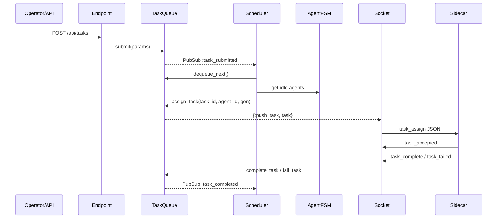
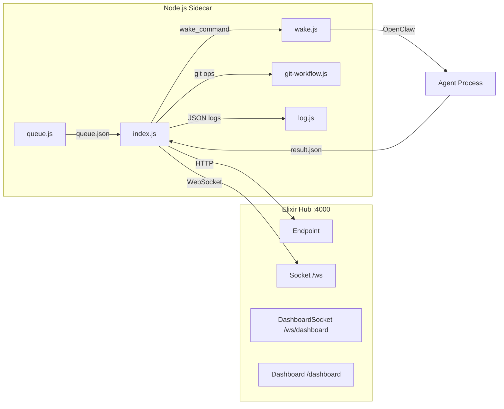

# Architecture Overview

AgentCom is an Elixir/OTP hub that coordinates autonomous agents via WebSocket-connected Node.js sidecars. Tasks flow in through the HTTP API, get scheduled to idle agents, executed by sidecar-managed agent processes, and results flow back through the same WebSocket connection. A real-time HTML dashboard at `/dashboard` provides visibility into the entire pipeline.

This document explains the system's structure, component relationships, and the reasoning behind key design decisions. It serves as the foundational reference that the [setup guide](setup.md), [daily operations guide](daily-operations.md), and [troubleshooting guide](troubleshooting.md) all build on.

## Supervision Tree

All services start under a single `AgentCom.Supervisor` with a `:one_for_one` strategy. Each child is independent -- if one crashes, only that child restarts. This is the right strategy because the services are loosely coupled through PubSub rather than direct calls, so a crash in `AgentCom.Alerter` has no reason to restart `AgentCom.TaskQueue`.

The ordering of children matters because dependencies flow downward. PubSub starts first because nearly every other service subscribes to it. The two Registries start early because `AgentCom.AgentSupervisor` and `AgentCom.Socket` look up processes by name through them. Bandit (the HTTP server) starts last because it accepts external connections -- everything it routes to must already be running.

```mermaid
graph TD
    SUP["AgentCom.Supervisor<br/>:one_for_one"]

    SUP --> PS["Phoenix.PubSub"]
    SUP --> REG["Registry<br/>AgentRegistry"]
    SUP --> CFG["Config<br/>DETS: agentcom_config"]
    SUP --> AUTH["Auth<br/>File: tokens.json"]
    SUP --> MBX["Mailbox<br/>DETS: agent_mailbox"]
    SUP --> CH["Channels<br/>DETS: channels, history"]
    SUP --> PRES["Presence<br/>In-memory"]
    SUP --> ANA["Analytics<br/>ETS"]
    SUP --> THREADS["Threads<br/>DETS: messages, replies"]
    SUP --> MHIST["MessageHistory<br/>DETS: message_history"]
    SUP --> REAP["Reaper<br/>Stale agent sweep"]
    SUP --> FSMREG["Registry<br/>AgentFSMRegistry"]
    SUP --> ASUP["AgentSupervisor<br/>DynamicSupervisor"]
    SUP --> TQ["TaskQueue<br/>DETS: task_queue, dead_letter"]
    SUP --> SCHED["Scheduler<br/>Stateless"]
    SUP --> MC["MetricsCollector<br/>ETS: agent_metrics"]
    SUP --> ALERT["Alerter<br/>5 rules, cooldowns"]
    SUP --> DS["DashboardState"]
    SUP --> DN["DashboardNotifier<br/>Push notifications"]
    SUP --> BKUP["DetsBackup<br/>Daily backup + compaction"]
    SUP --> BAN["Bandit<br/>HTTP :4000"]
```

See `AgentCom.Application` for the actual child spec list and the ETS table creation that happens before supervision starts (validation backoff, rate limit buckets, rate limit overrides). The telemetry handlers also attach before any child starts, so no early events are missed.

## Task Lifecycle

Tasks flow through a submit-schedule-assign-accept-complete pipeline. The key design choice is that the `AgentCom.Scheduler` is event-driven through PubSub, not polling. When `AgentCom.TaskQueue` accepts a new task via `submit/1`, it broadcasts a `:task_submitted` event. The Scheduler subscribes to this and immediately attempts to match the task to an idle agent. This means scheduling happens within milliseconds of submission rather than waiting for a polling interval.

The Scheduler also runs a 30-second periodic sweep as a safety net for missed events or stuck tasks. Tasks assigned for longer than 5 minutes without progress are automatically reclaimed and re-queued. Tasks that exhaust their retry count (default 3) move to the dead letter queue, where they can be manually retried via the API or dashboard.

See `AgentCom.TaskQueue` for the queue operations (submit, assign, complete, fail, retry) and `AgentCom.Scheduler` for the matching logic including capability-based assignment. Each agent has an `AgentCom.AgentFSM` (a `:gen_statem` state machine) that tracks its state through idle, assigned, working, and disconnected transitions, managed under `AgentCom.AgentSupervisor`.

## Agent Communication

Each agent is an external process (typically an OpenClaw CLI tool) that cannot maintain its own WebSocket connection. The Node.js sidecar solves this by acting as a persistent WebSocket relay -- it connects to the hub, stays connected, receives task assignments, wakes the agent process to execute them, and relays results back.

Authentication uses token-based auth rather than OAuth. Agents are internal trusted processes, not external users, so the simpler model is appropriate. A new agent registers via `POST /api/onboard/register` (unauthenticated, by design -- solves the bootstrap problem) and receives a token. All subsequent API and WebSocket interactions require this token.

The hub tracks agent liveness through a heartbeat/presence mechanism. Each sidecar sends periodic `ping` messages. `AgentCom.Presence` tracks connected agents in memory, and `AgentCom.Reaper` runs a 30-second sweep that evicts agents whose last heartbeat is older than 60 seconds. This handles the case where a sidecar crashes without sending a clean disconnect.

See `AgentCom.Socket` for the WebSocket handler (message routing, task push, heartbeat processing), `AgentCom.Presence` for the in-memory agent registry, and `AgentCom.Reaper` for the stale agent eviction logic.

## Data Storage

AgentCom uses DETS (Disk Erlang Term Storage) for persistence instead of an external database. This was a deliberate choice: the system is designed for a single BEAM node coordinating up to 5 agents. At this scale, DETS provides built-in persistence with no external dependencies -- no database server to install, configure, or maintain. DETS is part of OTP itself, so it's always available wherever Erlang runs.

Each DETS table is owned by a dedicated GenServer. This provides crash isolation (a corrupt table crashes only its owner, not the whole system) and serialized writes (DETS is not safe for concurrent writes from multiple processes). The owning GenServer becomes the single writer, while reads can go through it or directly to DETS depending on the access pattern.

| Table | Owner GenServer | Purpose |
|-------|----------------|---------|
| `task_queue` | `AgentCom.TaskQueue` | Active tasks (queued, assigned, completed) |
| `task_dead_letter` | `AgentCom.TaskQueue` | Failed tasks that exhausted retries |
| `agent_mailbox` | `AgentCom.Mailbox` | Per-agent message inbox |
| `message_history` | `AgentCom.MessageHistory` | Queryable message archive |
| `agent_channels` | `AgentCom.Channels` | Channel metadata and subscriptions |
| `channel_history` | `AgentCom.Channels` | Channel message history |
| `agentcom_config` | `AgentCom.Config` | Runtime key-value configuration |
| `thread_messages` | `AgentCom.Threads` | Thread message tracking |
| `thread_replies` | `AgentCom.Threads` | Thread reply chains |

`AgentCom.DetsBackup` handles backup, compaction, and corruption recovery for all 9 tables. Backups run daily and on demand via `POST /api/admin/backup`. Compaction runs on a configurable interval (default 6 hours) when fragmentation exceeds a threshold (default 10%). If corruption is detected, DetsBackup automatically restores from the latest backup -- or if no backup exists, it deletes the corrupted file and lets the owning GenServer start with an empty table (graceful degradation).

## Observability Stack

Observability is built in three layers, each feeding the next:

**Structured logging** uses `LoggerJSON` to emit JSON-formatted log lines to both stdout and a rotating file at `priv/logs/agent_com.log` (10MB per file, 5 rotated files, compressed on rotation). Sensitive fields like tokens are automatically redacted. Runtime log level can be changed via `PUT /api/admin/log-level` without restarting. All log entries include metadata like request IDs, agent IDs, and telemetry event names, making them filterable with `jq`.

**Telemetry events** are the backbone of metrics collection. `AgentCom.Telemetry` attaches handlers to events emitted by TaskQueue, Scheduler, Socket, DetsBackup, and the HTTP endpoint. These handlers run in the emitting process (not the MetricsCollector GenServer) to avoid bottlenecks, writing directly to a `:public` ETS table.

**Metrics aggregation** happens in `AgentCom.MetricsCollector`, which reads the ETS metrics table every 10 seconds and builds a snapshot containing queue depth, agent states, task durations, error rates, and per-agent statistics. The snapshot is cached in ETS for zero-cost reads from the `/api/metrics` endpoint. This snapshot also feeds the dashboard's uPlot charts (360-point rolling window = 1 hour at 10-second intervals).

**Alerting** is handled by `AgentCom.Alerter`, which evaluates 5 rules against each metrics snapshot:

| Rule | Severity | What It Detects |
|------|----------|-----------------|
| `queue_growing` | WARNING | Queue depth increasing for 3+ consecutive checks |
| `high_failure_rate` | WARNING | Task failure rate exceeds 50% |
| `stuck_tasks` | CRITICAL | Tasks assigned for >5 minutes without progress |
| `no_agents_online` | CRITICAL | All previously registered agents disconnected |
| `high_error_rate` | WARNING | More than 10 errors per hour |

CRITICAL alerts bypass cooldown periods; WARNING alerts respect per-rule cooldowns to avoid notification spam. The Alerter has a 30-second startup delay to prevent false positives before agents have had time to reconnect after a hub restart. Alerts appear on the dashboard and trigger browser push notifications via `AgentCom.DashboardNotifier`.

## Design Rationale Summary

| Decision | Rationale |
|----------|-----------|
| DETS over Postgres | No external dependencies, built into OTP, sufficient at 5-agent scale |
| GenServer per table | Crash isolation, serialized DETS writes, clear ownership model |
| Single BEAM node | No distribution complexity, Tailscale for remote access if needed |
| Node.js sidecar | Agents are external CLI processes, need a persistent WebSocket relay |
| Token auth (not OAuth) | Internal system, agents are trusted, tokens provisioned via API |
| ETS for metrics | High-frequency writes from telemetry handlers, zero-cost reads for dashboard |
| PubSub for events | Decoupled components, no direct GenServer dependencies between services |
| Event-driven scheduler | PubSub-triggered scheduling within milliseconds, periodic sweep as safety net |
| Lazy token buckets | Zero background cost per agent for rate limiting, refill computed on access |
| JSON structured logging | Machine-parseable output, filterable with jq, redaction built in |
